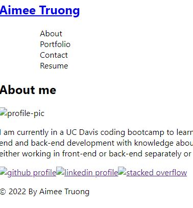

# react-portfolio

## Description
    AS AN employer looking for candidates with experience building single-page applications,
    I WANT to view a potential employee's deployed React portfolio of work samples
    SO THAT I can access whether they're a good candidate for an open position

---

## Table of Contents
- [Usage](#usage)
- [First-Look](#first-look)
- [Contributing](#contributing)
- [Questions](#questions)

---

## Usage
- To have a quick view of my portfolio in a React app style

## First Look

## Contributing
- Third-party Assets: React

## Questions
>Aimee Truong
>
>[My GitHub Profile](https://github.com/aimtruong)
>
>Email me at aimtruong@ucdavis.edu if you have any additional questions!

    
